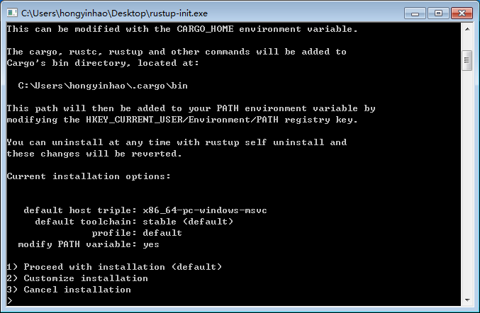
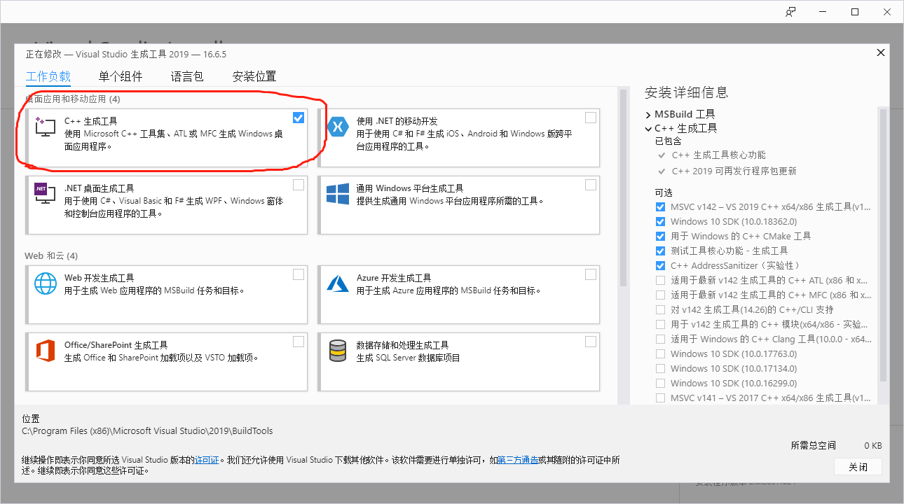
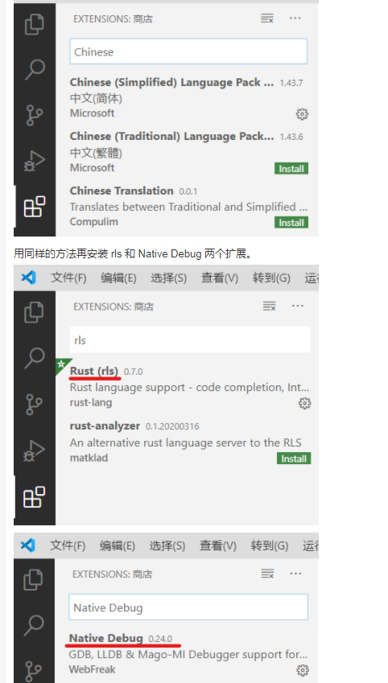
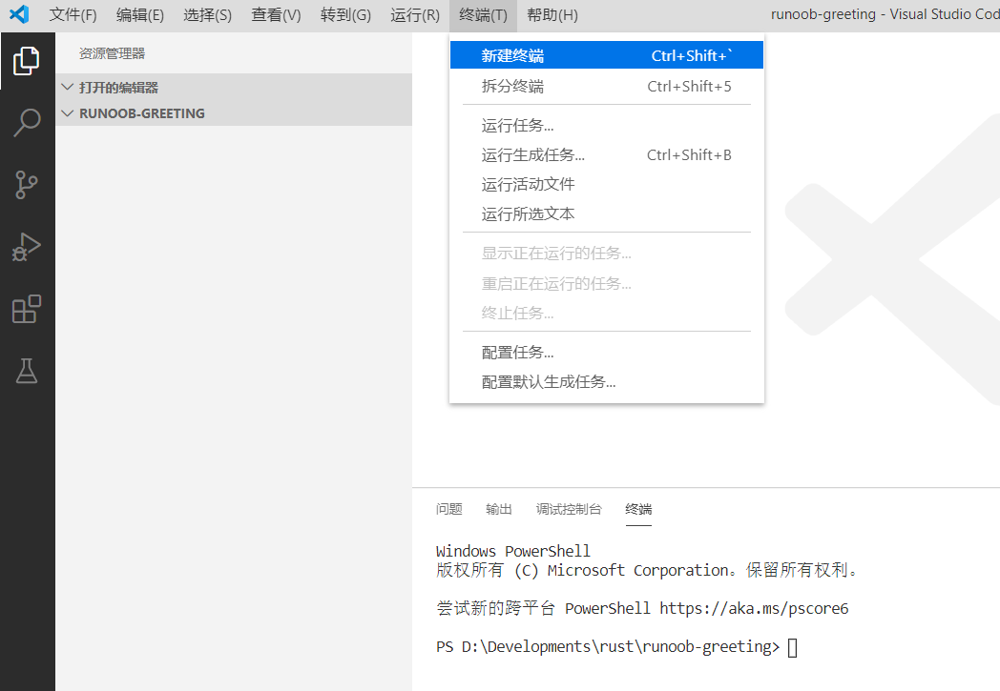
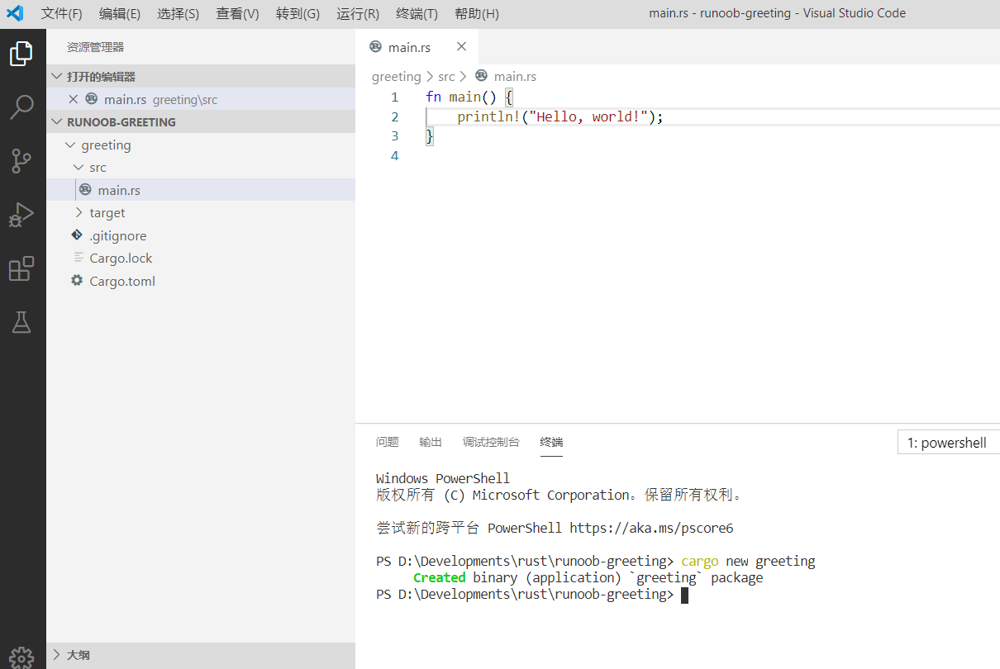
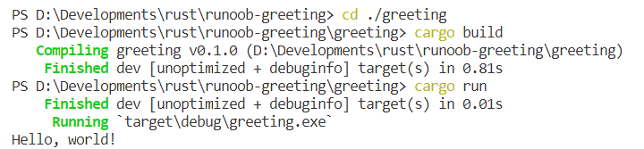

# firts rust

[Rust 编译工具](https://www.rust-lang.org/zh-CN/tools/install)

下载好的 Rustup 在 Windows 上是一个可执行程序 rustup-init.exe，直接执行就行了



直接输入1并回车，选择默认等待安装完成即可

安装完成后可以通过以下命令测试

```shell
rustc -V  # 注意大写的V
cargo -V
```

如果以上两个命令能够输出你安装的版本号，就是安装成功了

[Visual Studio Tools 2019](https://visualstudio.microsoft.com/zh-hant/visual-cpp-build-tools/)

Windows 操作系统需要安装 Visual Studio 2013 或以上的环境（需要 C/C++ 支持）以使用 MSVC 或安装 MinGW + GCC 编译环境；

下载好 VS2019 后安装 C++ 生成工具



[Visual Studio Code](https://code.visualstudio.com/Download)

下载完 Visual Studio Code (下文简称 VSCode)安装包之后启动安装向导安装（此步骤不在此赘述）

打开 VSCode 在左侧栏找到 "Extensions"  安装 chinese 、rls、Native Debug 三个扩展



重新启动 VSCode，Rust 的开发环境就搭建好了

现在新建一个文件夹用 VSCode 打开，然后选择菜单栏中的"终端"-"新建终端"，会打开一个新的终端



在终端中输入命令：

```shell
cargo new greeting 
```

会当前文件下下会构建一个名叫 greeting 的 Rust 工程目录。



在终端中输入以下三个命令：

```
cd ./greeting 
cargo build
cargo run
```



至此，你成功的构建了一个 Rust 命令行程序！